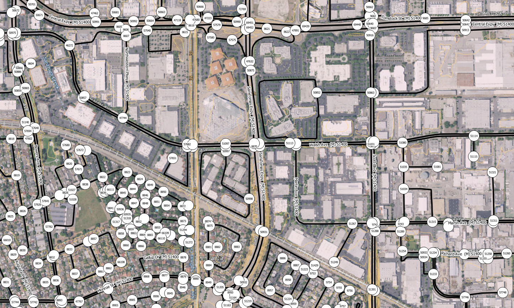
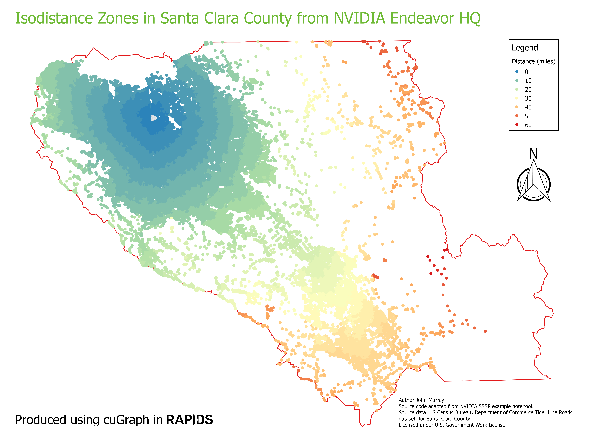

# RapidsSantaClaraRoadGraph
Example cuGraph Python Notebook for RAPIDS AI with Road Graph of Santa Clara County to calculate a Single Source Shortest Path (SSSP) distance table from NVIDIA Endeavor HQ.

We will be using the US Census Bureau, Department of Commerce Tiger Line Roads dataset, for Santa Clara County, converted into a graph.
A sample is shown below:

This is a weighted graph, using the edge distance in yards.

The raw data source does not contain nodes. These have been derived through Spatial Inference using Fusion Data Science Spatia software.

Because the raw data does not contain information about one way roads and restricted access intersections, assumptions have been made and therefore the data should not be used for navigation purposes.  

__Note__: The derived dataset starts with vertex ID 1 which the cuGraph analytics assume a zero-based starting ID.  

Base image: USGS Imagery Topo Base Map from U.S. Geological Survey, National Geospatial Program    
Licensed under [U.S. Government Work License](https://www.usa.gov/government-works)

Adapted from NVIDIA cuGraph SSSP example notebook licensed under Apache License 2.0

To to run, copy the cloned archive to your Rapids Notebooks folder.

Then download the Santa Clara Graph [from here](https://urli.uk/JHYVJP) and store the csv file in a subfolder named data.

If you want Coordinates for the nodes in WGS84 Latitude & Longitude, [download this file](https://urli.uk/2YOP9O).

This map shows a road isodistance map generated from the output SSSP table in QGIS.

 

# Further Reading
* [Search for TIGER/Line on DATA.GOV](https://catalog.data.gov/dataset?metadata_type=geospatial&organization=census-gov&q=tiger+line+2018&tags=roads&_tags_limit=0)

**_Disclaimer:_** *Not to be used for navigation purposes.*
